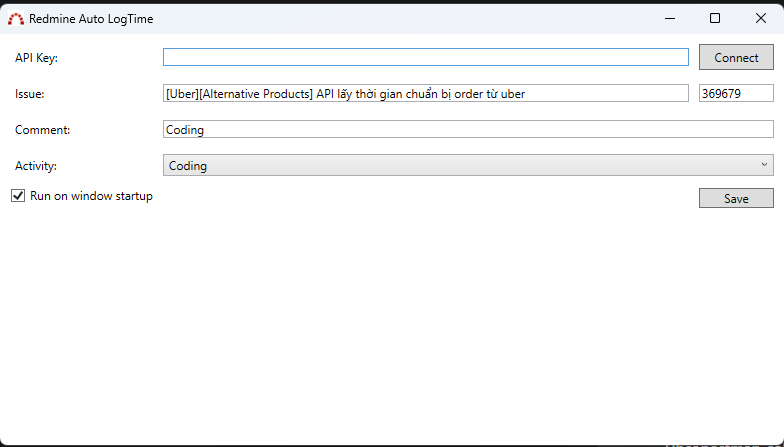

# Program Usage Guide

## Step 1: Program Image

## Step 2: Input API Key
1. Open the program.
2. Look for the section or prompt labeled "Input API Key".
3. Enter your API key into the designated field.

## Step 3: Press Connect
After entering your API key, locate and press the "Connect" button. This will establish a connection to the relevant service.

## Step 4: Input Issue ID
Once connected, find the area designated for "Input Issue ID".
1. Enter the ID of the issue you want to work on.
2. This could be a unique identifier assigned to each issue in your system.

## Step 5: Input Comment
Next, you'll see a field for "Input Comment".
1. Type in the comment you want to add to the issue.
2. This could be any additional information or updates regarding the issue.

## Step 6: Input Activity
Locate the section where you can "Input Activity".
1. Enter the type of activity or action you're performing related to the issue.
2. This could be categorizing the work done, such as "Development", "Testing", or "Bug Fixing".

## Step 7: Tick "Run on Startup"
If you want the program to run automatically every time your system starts, find the option labeled "Run on Startup" and check the box.

## Step 8: Press Save
Finally, press the "Save" button to apply your inputs and settings.
